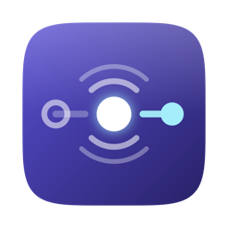
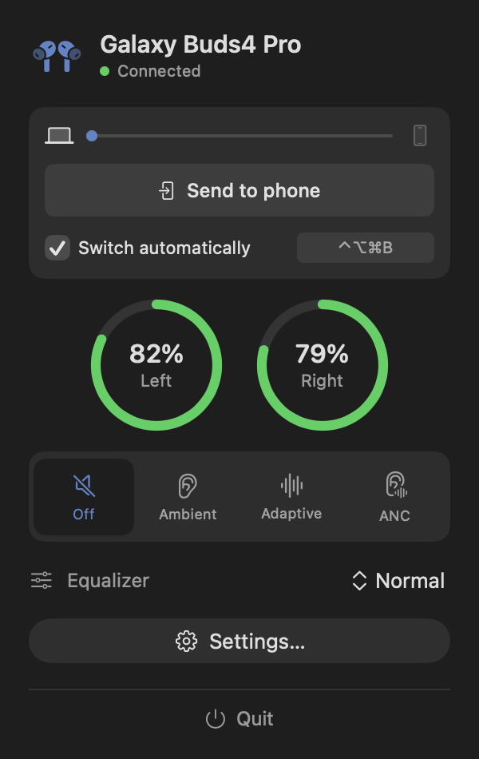
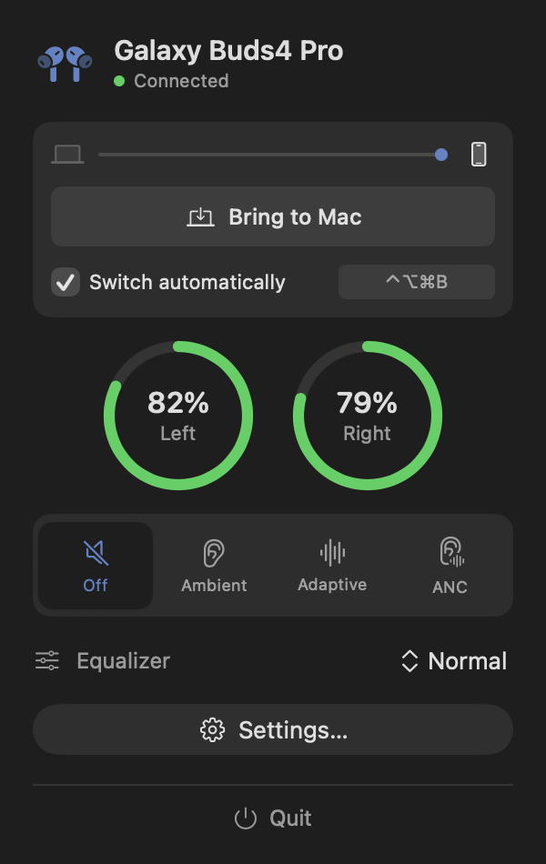

<div align="center">



# BudSwitch

**Your earbuds follow you between your Mac and your phone — automatically.**
**Battery, ANC and EQ for Galaxy Buds, in the same panel.**

<sub>Free and open source · No account, no telemetry, no network access</sub>

[](../../releases/latest)
&nbsp;
[](https://github.com/offbr0wn/BudSwitch/actions/workflows/build.yml)
&nbsp;

&nbsp;


</div>

---

Most earbuds hold one connection at a time. Switching from your phone to your Mac means
digging into Bluetooth settings, disconnecting, reconnecting — every single time.

BudSwitch does it for you. Press play on your Mac and your buds come to you. Walk away and
it frees them, so your phone can take them back — [one routine on the
phone](#make-it-work-both-ways) makes that automatic too.

For **Galaxy Buds** it is also a full control panel: per-bud battery, noise control,
equaliser, touch controls and find-my — built on
[vedatkilic/galaxy-buds-mac](https://github.com/vedatkilic/galaxy-buds-mac).

<div align="center">

</div>

Built for **Samsung Galaxy Buds4 Pro**, which have no true multipoint for non-Samsung
devices and whose Auto Switch is Galaxy-only. Works with any paired Bluetooth audio device,
and takes a much faster path when the device *does* support multipoint.

---

## Install

1. **[Download the latest release](../../releases/latest)** and open the `.dmg`.
2. Drag **BudSwitch** onto **Applications**.
3. Open it. macOS will block the first launch — see below.

> [!IMPORTANT]
> **macOS will refuse to open BudSwitch the first time.** It isn't notarized, so you get
> *"Apple could not verify BudSwitch is free of malware"* with only **Done** and
> **Move to Bin**. Click **Done** — do not move it to the bin.
>
> **On macOS 15 Sequoia and later**, open **System Settings → Privacy & Security**, scroll
> to the bottom, and click **Open Anyway** next to the BudSwitch message. Confirm, and it
> launches. Once per machine.
>
> **On macOS 14 Sonoma**, right-click the app in Applications → **Open** → **Open**.
>
> Prefer one command? This does the same thing:
>
> ```bash
> xattr -dr com.apple.quarantine /Applications/BudSwitch.app
> ```
>
> **Why the warning?** BudSwitch is free and unnotarized. Notarization means paying Apple
> $99/year to have them scan the binary — worth it for paid software, hard to justify for
> a small free tool. The app **is** code-signed and its signature verifies; it simply
> isn't registered with Apple.
>
> **Don't want to take that on trust?** You shouldn't have to. Every release is
> [built by GitHub Actions](../../actions/workflows/release.yml) from the tagged source in
> this repo — never uploaded by hand — and each release lists the SHA-256 of its own DMG so
> you can check your download. Or [build it yourself](#build-from-source) in one command
> and skip the warning entirely.

Allow **Bluetooth** when asked. It's the only permission BudSwitch needs — the keyboard
shortcut requires nothing extra.

Then look for the headphones icon in your menubar. There's no Dock icon and no window —
that icon is the whole app.

**Requirements:** macOS 14 (Sonoma) or later. Your earbuds must already be paired in
System Settings → Bluetooth; BudSwitch switches between devices you've paired, it doesn't
pair them for you.

---

## What it does

| Trigger | Action |
| :-- | :-- |
| Audio starts from an allowlisted app | Buds connect to the Mac |
| Mac idle 5 minutes, nothing playing | Buds released — your phone can take them |
| Mac sleeps or locks | Buds released immediately |
| <kbd>⌃</kbd><kbd>⌥</kbd><kbd>⌘</kbd><kbd>B</kbd> from anywhere | Toggle, always wins |

<div align="center">

<br><em>Released — the phone can take them</em>
</div>

The route line shows which side holds your buds, and the button moves them. The menubar
icon is filled when they're on your Mac, dimmed when they're not.

**On Galaxy Buds** the same panel shows per-bud battery (a bud left in the case reads
`—`, not 0%), noise control, equaliser presets, and a settings window with touch controls
and find-my. Those need the data connection, which is separate from the audio one — the
status dot is green when both are up, yellow when only audio is.

> [!NOTE]
> **"Send to phone" releases the buds — it can't make your phone grab them.** Connecting
> has to be initiated from the phone. Playing something on your phone picks them up
> straight away; the section below automates even that.

---

## Make it work both ways

BudSwitch handles **phone → Mac** on its own. For **Mac → phone**, the phone has to do the
connecting — nothing on the Mac can force it ([why](docs/spike-results.md)).

Set up one automation on your phone and the pair behaves like real multipoint. Pick your
phone below.

<details open>
<summary><strong>Samsung Galaxy</strong> — built in, no extra app</summary>

<br>

Uses **Modes and Routines**, which ships with One UI.

**1.** Open **Settings** → **Modes and Routines**

**2.** Tap the **Routines** tab at the top

**3.** Tap **+** (top right)

**4.** Tap **If**

**5.** In the search box type `media`, then tap **Media is playing**
*(may be listed under **Sound and vibration**, or called "Media sound started")*

**6.** If it asks which apps, choose **All apps** → **Done**

**7.** Tap **Then**

**8.** Search `bluetooth` → tap **Connect Bluetooth device**

**9.** Pick your earbuds → **Done**

**10.** Scroll to the bottom → **When this routine ends** → choose **Do nothing**

**11.** Tap **Save**, give it a name, **Done**

> ⚠️ **Don't skip step 10.** "Media is playing" is a *condition*, not a one-off
> trigger. Modes and Routines undoes a routine's actions when its condition stops holding
> — so without this step **your earbuds disconnect the moment you pause a video**.

> 💡 **The media trigger doesn't catch every app.** In testing it fired for YouTube and
> Spotify but not Instagram or Twitter, which play inline video on a stream Android
> doesn't count as media.
>
> If you use those, add a **second** routine: **If** → **App** → **App opened** → tick
> Instagram, X, TikTok. **Then** → **Connect Bluetooth device** → your earbuds. Note it
> fires when you *open* the app, not when a video plays.

</details>

<details>
<summary><strong>Other Android</strong> — needs Tasker (paid, ~£3)</summary>

<br>

Android has no built-in equivalent. [Tasker](https://tasker.joaoapps.com/) is the reliable
option and does the same job.

**1.** Install **Tasker** from the Play Store and grant the permissions it asks for

**2.** Find your earbuds' MAC address — **Settings → Connected devices → (gear icon next
to your earbuds)**, or run this on the Mac while they're connected:

```bash
system_profiler SPBluetoothDataType | grep -A2 "your earbuds"
```

**3.** In Tasker, open the **Profiles** tab → **+** → **Event** → **Display** →
**Display Unlocked**

**4.** When prompted for a task, choose **New Task**, name it `Connect buds`

**5.** Tap **+** → **Net** → **Bluetooth Connect**

**6.** Set **Address** to your earbuds' MAC, leave the rest as is

**7.** Back out (top-left arrow) to save. Toggle the profile **on**.

This connects on unlock rather than on playback — Tasker's media triggers are less
reliable across apps, and unlock is close enough in practice.

*Free alternative:* **MacroDroid** has a similar Bluetooth-connect action with a free
tier, though it caps the number of macros.

</details>

<details>
<summary><strong>iPhone</strong> — not possible automatically</summary>

<br>

iOS Shortcuts **cannot connect to a specific Bluetooth device** — Apple exposes no such
action, and there is no third-party workaround.

What you can do:

- **Play something on the phone.** iOS connects to your last-used audio device, so
  starting a track or video pulls the earbuds over. One tap, no setup.
- **Add a Shortcuts automation** for *Open App* → *Set Playback Destination*, which works
  only for some apps and is unreliable in practice.

Realistically, on iPhone the manual tap is the answer. BudSwitch still saves you the trip
into Bluetooth settings on the Mac side.

</details>

### Check it worked

1. On the Mac, press <kbd>⌃</kbd><kbd>⌥</kbd><kbd>⌘</kbd><kbd>B</kbd> to release the earbuds.
2. On the phone, play something.
3. The earbuds should connect within a second or two.

If nothing happens on a Galaxy, open **Modes and Routines → Routines → (your routine) →
History** — it records whether the routine actually fired, which tells you if the problem
is the trigger or the connect.

Full walkthrough with more trigger options — on unlock, or when the earbuds go idle:
**[docs/phone-routine.md](docs/phone-routine.md)**

---

### It won't take your buds at the wrong moment

Each of these exists because the naive version got it wrong:

- **Never releases while audio is playing.** Idle is measured from keyboard and mouse
  input — and watching a film is exactly when you touch neither. Playing audio counts as
  activity, so your buds stay put, and the timer re-arms so they still go to your phone
  once playback actually ends.
- **Never releases during a call.** Detected via a live audio *input*, since dropping the
  link takes your microphone with it.
- **Pausing doesn't release.** Only idle, sleep and lock do.
- **Sustained audio only.** Playback must run 2 seconds continuously, so a notification
  chime can't yank your buds off your phone.
- **10-second cooldown** after every switch, so triggers can't fight each other.

---

## Settings

Most of it lives in the panel: device picker, "Switch automatically", and the global
shortcut — click it and press new keys.

The rest is `defaults`, applied on next launch:

```bash
defaults write com.budswitch.mac idleMinutes -int 15
```

| Key | Default | What it does |
| :-- | :-- | :-- |
| `idleMinutes` | `5` | Minutes idle before releasing (1–30) |
| `allowlist` | *see below* | Bundle IDs allowed to trigger a connect |
| `allowlistEnabled` | `true` | `false` lets *any* audio trigger a connect |
| `automationEnabled` | `true` | Master switch for all automatic triggers |
| `showHUD` | `true` | Overlay shown when you press the shortcut |
| `menubarSymbol` | `headphones` | Any SF Symbol name |
| `hotkeyEnabled` | `true` | Global shortcut on/off |

Default allowlist: Brave, Spotify, Music, Safari, Chrome, Zoom, Slack, Teams.

```bash
defaults write com.budswitch.mac allowlist -array com.brave.Browser com.spotify.client
```

---

## Build from source

```bash
git clone https://github.com/offbr0wn/BudSwitch.git
cd BudSwitch
./build.sh && open build/BudSwitch.app
```

No Xcode project — SPM builds it (`Package.swift`) and `build.sh` assembles the universal
`.app` around the result. `./package.sh dmg` builds the installer.

Every push to `main` and every pull request builds on a macOS runner and checks that the
binary is universal, the Bluetooth usage description is present, `LSUIElement` is set, and
the signature verifies. Tagging a version publishes a release:

```bash
./scripts/bump-version.sh 1.1.0
git push origin main --tags
```

> [!NOTE]
> Always launch via `open`, never by running the binary directly. A bare executable is
> killed by macOS on its first IOBluetooth call regardless of signing; only a `.app`
> launched through LaunchServices gets Bluetooth access.

<details>
<summary><strong>Project layout</strong></summary>

```
Sources/
  App/         AppDelegate, StatusBarController, AppState
  Switching/   AudioRouteProbe, AudioMonitor, IdleMonitor, PowerMonitor,
               AppFocusMonitor, Arbiter, Hotkey, BluetoothController
  Bluetooth/   BluetoothManager (SPP), SppMessage, MessageId, MultipointInfo
  Models/      BudsStatus, BudsModel, NoiseControlMode, EqualizerPreset
  Views/       MenuPopoverView, DashboardView, SoundAncView, WizardView, …
  UI/          HUD, ShortcutRecorder
  Resources/   localisations
Resources/     Info.plist, AppIcon.icns, makeicon.swift
```

`Switching/` is BudSwitch's own engine; `Bluetooth/`, `Models/` and `Views/` come from
[galaxy-buds-mac](https://github.com/vedatkilic/galaxy-buds-mac) (MIT, see
`LICENSE-galaxy-buds-mac`).

Every state transition is logged. Use `log stream` — `log show` lags by minutes and will
convince you things are broken when they aren't:

```bash
log stream --predicate 'subsystem == "com.budswitch.mac"' --level debug
```

</details>

---

## How it works

<details open>
<summary><strong>Three decisions carry the design</strong></summary>

<br>

**Connection state comes from CoreAudio, not IOBluetooth.** `openConnection()` creates a
*baseband* link — a successful return doesn't mean audio routes to the Mac — and
`isConnected()` is cached and goes stale. CoreAudio device UIDs embed the Bluetooth MAC
(`AA-BB-CC-DD-EE-FF:output`), so matching the default output UID against the device address
gives a trustworthy signal. No entitlement, no permission prompt.

**Multipoint devices take a shortcut.** If the buds already hold an audio link to this Mac,
there's nothing to negotiate — switching is just moving the system output. That's **~6ms**,
versus 1.8–6.8s through Bluetooth. Detection is free: a device only appears in CoreAudio's
output list while it holds a link, so "present but not the default output" *is* the
multipoint signal.

**Non-multipoint devices get retries.** A real Bluetooth negotiation — 3 attempts with
0.5s/1s backoff, judged by whether audio actually arrived. Measured connects have ranged
1.8s to 6.8s on identical hardware, so one attempt isn't enough.

</details>

<details>
<summary><strong>Gotchas found the hard way</strong></summary>

<br>

- `IOBluetoothDevice(addressString:)` can block **indefinitely** when the device is
  unreachable — not just slowly. Constructed once per address and cached, off the hot path.
- Virtual audio devices (Background Music, Teams) can become the default output and mask
  real hardware. Excluded from playback detection and flagged in the UI.
- The global shortcut uses `RegisterEventHotKey`, not `NSEvent.addGlobalMonitorForEvents`.
  The latter asks for the entire system keystroke stream and is gated behind Accessibility;
  the former registers one combination and needs no permission at all.
- A bare CLI binary cannot touch IOBluetooth. It aborts on the *first* call, before your
  code runs — embedding the usage description and code-signing are both insufficient.

</details>

---

## Status

Working and in daily use.

One open question remains: the **phone → Mac steal** — whether `openConnection()` can take
the link from a phone that currently holds non-multipoint buds. It can't be tested with a
multipoint headset, since those simply hold both links, which is the opposite situation.
Full write-up in [docs/spike-results.md](docs/spike-results.md).

The Mac → phone direction is solid and independent of that answer.

**Not built yet:** launch at login (`SMAppService`), a log viewer in settings, and an
optional Android companion to release from the phone side.

Issues and pull requests welcome.

---

<div align="center">
<sub>MIT licensed · Built with Swift and SwiftUI</sub>
</div>
